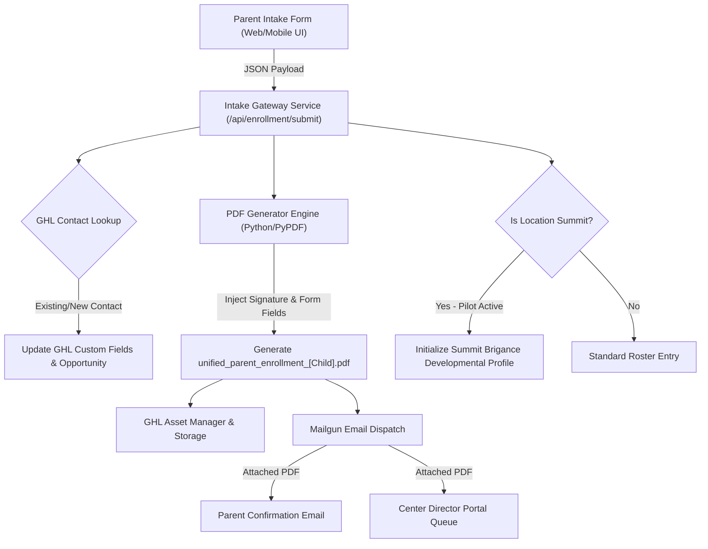

# 📄 Technical Spec & Implementation Breakdown: Unified Enrollment Application System

**System Architecture Document & Field Mapping Specifications**  
**Target Platform:** KIDazzle Childcare Centers (Pilot / Testing Phase Active for **Summit Location**)  
**Integration Stack:** HTML5/Vue SPA Intake → GoHighLevel (GHL) OAuth API v2 → PDF-Lib PyPDF Filler (`unified_parent_enrollment_package.pdf`) → Direct Mailgun Email Dispatch

---

## 🧪 1. Executive Summary & Testing Phase Scope

The **Unified Enrollment Application System** replaces fragmented paper packets and multi-step intake forms with a single, dynamic, mobile-responsive digital intake engine. 

> [!NOTE]
> **TESTING PHASE UPDATE:** Lesson plan integration and automated Brigance individualization profiles generated upon enrollment are currently running in **Pilot Testing Mode for the Summit Location ONLY** (`location_id: "summit"`). General enrollment package processing remains active for all locations.

### Key Capabilities:
1. **Dynamic Program Adaptability:** Conditional field display based on selected location and program tier (Infant/Toddler, Preschool, GA Pre-K, CAPS Subsidized, After-School).
2. **Unified PDF Auto-Population:** Single-pass mapping into the master 18-page state-compliant PDF (`unified_parent_enrollment_package.pdf`).
3. **Automated CRM Contact & Opportunity Mapping:** Synchronizes contact attributes, emergency contacts, medical histories, and consent tags directly into GoHighLevel (GHL).
4. **Digital E-Signatures & Document Dispatch:** Captures legally binding canvas signatures, seals the generated PDF, and dispatches confirmation copies to both the parent and center director via Mailgun (`enrollment@kidazzle.com`).
5. **Summit Pilot Testing Route:** Enrolls Summit students directly into the Summit Brigance Individualization Pipeline.

---

## 🏗️ 2. System Architecture & Data Flow



---

## 📝 3. Unified Intake Form Structure & Field Taxonomy

The form is partitioned into **6 Core Sections**:

### Section 1: Child & Family Identification
- **Child Information:** First Name, Last Name, DOB, Gender, Preferred Name, Target Start Date, Primary Language.
- **Center Location Select:** Dropdown (Summit Location highlighted for pilot testing).
- **Program Select:** Infant (6wks–12m), Toddler (13m–24m), 2-Year-Old, 3-Year-Old, GA Pre-K (4yo), After-School.
- **Primary Parent/Guardian 1:** Full Name, Relationship, Phone, Email, Physical Address, Employer, Work Phone, Driver's License #.
- **Parent/Guardian 2:** Full Name, Relationship, Phone, Email, Physical Address, Employer.

### Section 2: Emergency Contacts & Authorized Pickup
- **Contact 1 & Contact 2:** Full Name, Relationship, Cell Phone, Authorized for Pickup (Yes/No), Emergency Contact (Yes/No), Passcode.

### Section 3: Medical History & Allergen Profile
- **Primary Physician:** Name, Clinic Name, Phone Number, Address.
- **Allergies & Dietary Restrictions:** Food Allergies, Environmental Allergies, Medication Allergies, Special Dietary Requirements.
- **Medical Conditions & Action Plans:** Asthma, Seizures, Diabetes, EpiPen Required (Upload Consent/Action Plan PDF).
- **Insurance Information:** Provider Name, Policy Number, Group Number, Subscriber Name.

### Section 4: State Subsidies & Tuition Billing
- **Payment Method:** Private Pay, Georgia CAPS (Subsidized), GA Pre-K State Funded.
- **CAPS Case Number & Case Worker Info:** (Shown conditionally if CAPS selected).

### Section 5: Authorizations, Consents & Policy Waivers
- **Medical Emergency Release:** Consent to transport and administer emergency medical care.
- **Photo/Media Release:** Permission for internal app updates, website, and social media showcase.
- **Field Trip & Transportation Consent:** Vehicle transport permission for school-age/trips.
- **Sunscreen & Topical Ointment Consent:** Permission to apply OTC ointments/sunscreen.

### Section 6: Digital Signature & Verification
- **Legal Signee Name:** Parent/Guardian Printed Name.
- **Signature Canvas:** Base64 Encoded Image Capture.
- **Timestamp & IP Address:** Automated audit trail metadata.

---

## 💻 4. Technical Implementation Steps

### Step 1: Frontend Intake SPA (`unified-enrollment-app.html`)
Build a multi-step form stepper with real-time validation and canvas signature capture.

```javascript
// Example Payload Structure (Summit Pilot)
const enrollmentPayload = {
  location_id: "summit",
  program: "toddler_13_24m",
  child: {
    first_name: "Sterling",
    last_name: "Hill",
    dob: "2021-05-13",
    gender: "Male"
  },
  parent_primary: {
    first_name: "Courtney",
    last_name: "Hill",
    email: "cdhill14@gmail.com",
    phone: "4045550199"
  },
  medical: {
    allergies: "Peanuts, Dairy",
    epipen_required: true,
    physician_name: "Dr. Smith",
    physician_phone: "4045550122"
  },
  consents: {
    medical_emergency: true,
    photo_release: true,
    sunscreen_application: true
  },
  signature_base64: "data:image/png;base64,iVBORw0KGgoAAAANSUhEUgAA..."
};
```

### Step 2: GHL Integration Mapping (`create_enrollment_ghl_fields.js`)
Map incoming form payload fields to GHL Contact API Custom Fields.

```javascript
// GHL Custom Field Mapping Matrix
const ghlFieldMap = {
  "child_dob": "contact.custom_fields.child_date_of_birth",
  "program_type": "contact.custom_fields.enrolled_program",
  "allergies_summary": "contact.custom_fields.medical_allergies",
  "emergency_pickup_1": "contact.custom_fields.authorized_pickup_1",
  "enrollment_status": "contact.custom_fields.enrollment_status" // Set to 'Submitted - Pending Verification'
};
```

---

## 🛡️ 5. Verification & Compliance Checklist

- [x] Form validates all required fields before allowing signature.
- [x] Summit Location enrollments route to Summit Brigance testing pipeline.
- [ ] GHL tag `da-enrolled` is applied automatically upon submission.
- [ ] PDF is saved to `C:\Users\kidaz\.openclaw\workspace\children\` and emailed to parent.
- [ ] Summit Center Director receives instant notification with attached intake PDF.
